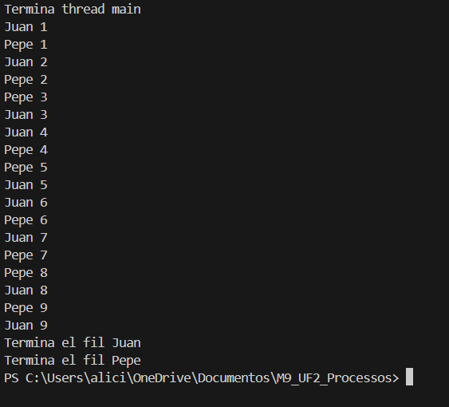

# Activitat 01: Programació de fils
## Comportament 1 
## Codí
```java
public class Principal {
    public static void main(String[] args) {
        Fil juan = new Fil("Juan");
        Fil pepe = new Fil("Pepe");
        juan.start();
        pepe.start();
        System.out.println("Termina thread main");
    }
}
```
```java
public class Fil extends Thread {
    private String nombre;
    public Fil(String nombre) {
        this.nombre = nombre;
    }
    @Override
    public void run() {
        for (int i = 0; i <= 9; i++) {
            System.out.println(nombre + " " + i);
            try {
                Thread.sleep(1000);
            } catch (InterruptedException e) {
                e.printStackTrace();
            }
        }
        System.out.println("Termina el fil " + nombre);
    }
}
```
## Resultat


## Comportament 2

## Comportament 3