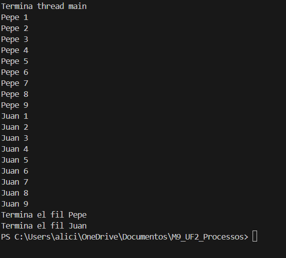
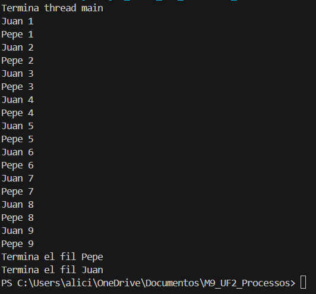

# Activitat 01: Programació de fils
## Comportament 1 
## Codí
```java
public class Principal {
    public static void main(String[] args) {
        Fil juan = new Fil("Juan");
        Fil pepe = new Fil("Pepe");
        juan.start();
        pepe.start();
        System.out.println("Termina thread main");
    }
}
```
```java
public class Fil extends Thread {
    private String nombre;
    public Fil(String nombre) {
        this.nombre = nombre;
    }
    @Override
    public void run() {
        for (int i = 0; i <= 9; i++) {
            System.out.println(nombre + " " + i);
            try {
                Thread.sleep(1000);
            } catch (InterruptedException e) {
                e.printStackTrace();
            }
        }
        System.out.println("Termina el fil " + nombre);
    }
}
```
## Resultat
Es creen dos fils, **Juan** i **Pepe**, i es llancen simultàniament amb `juan.start()` i `pepe.start()`.

La línia `System.out.println("Termina thread main");` s'executa immediatament després d’iniciar els fils perquè el codi principal no espera que els fils acabin.

Cada fil executa el seu codi dins el mètode `run()` i imprimeix el seu nom seguit d’un nombre (de 0 a 9).

Hi ha un retard de **1000 ms (1 segon)** entre cada iteració per simular temps de treball.

Com que els fils s’executen en paral·lel, l’ordre d’impressió dels missatges de **Juan** i **Pepe** no està garantit, depenent de la planificació del sistema operatiu.


## Comportament 2

## Coidí
```java
public class Principal {
    public static void main(String[] args) {
        Fil pepe = new Fil("Pepe");
        Fil juan = new Fil("Juan");
        System.out.println("Termina thread main");
        // Iniciar el hilo de Pepe
        pepe.start();
        try {
            pepe.join(); // Espera a que Pepe termine antes de continuar
        } catch (InterruptedException e) {
            e.printStackTrace();
        }
        // Iniciar el hilo de Juan
        juan.start();
        try {
            juan.join(); // Espera a que Juan termine antes de continuar
        } catch (InterruptedException e) {
            e.printStackTrace();
        }
        // Mensajes finales
        System.out.println("Termina el fil Pepe");
        System.out.println("Termina el fil Juan");
    }
}
```
```java
public class Fil extends Thread {
    private String nom;
    public Fil(String nom) {
        this.nom = nom;
    }
    @Override
    public void run() {
        for (int i = 1; i <= 9; i++) {
            System.out.println(nom + " " + i);
            try {
                Thread.sleep(100); // Simula tiempo de procesamiento
            } catch (InterruptedException e) {
                e.printStackTrace();
            }
        }
    }
}
```

## Resultat
Es crea primer el fil **Pepe** i després el fil **Juan**.
S’imprimeix **"Termina thread main"** abans de començar els fils.
S’inicia el fil **Pepe** amb **`pepe.start()`** i es fa servir **`pepe.join()`** per esperar que acabi completament abans d’iniciar el següent fil.
Quan **Pepe** acaba, s’inicia el fil **Juan** amb **`juan.start()`**, i de nou el programa espera amb **`juan.join()`** fins que acabi.

Després que tots dos fils hagin finalitzat, s’imprimeixen els missatges:

**"Termina el fil Pepe"**
**"Termina el fil Juan"**.

El resultat sempre mostra primer tots els missatges de **Pepe** i després tots els de **Juan**, ja que l’execució de cada fil és seqüencial gràcies a **`join()`**.



## Comportament 3

## Coidí
```java
public class Principal {
    public static void main(String[] args) {
        Object lock = new Object(); // Objeto compartido para sincronización
        // Crear hilos con sus identificadores
        Fil juan = new Fil("Juan", 1, lock);
        Fil pepe = new Fil("Pepe", 2, lock);
        // Mensaje principal
        System.out.println("Termina thread main");
        // Iniciar los hilos
        juan.start();
        pepe.start();
        // Esperar a que terminen ambos hilos
        try {
            juan.join();
            pepe.join();
        } catch (InterruptedException e) {
            e.printStackTrace();
        }
        // Mensajes finales
        System.out.println("Termina el fil Pepe");
        System.out.println("Termina el fil Juan");
    }
}
```
```java
public class Fil extends Thread {
    private String nom;
    private Object lock;
    private static int turno = 1; // Controla el turno de ejecución
    private int id;              // Identificador del hilo (1 para Juan, 2 para Pepe)
    public Fil(String nom, int id, Object lock) {
        this.nom = nom;
        this.id = id;
        this.lock = lock;
    }
    @Override
    public void run() {
        for (int i = 1; i <= 9; i++) {
            synchronized (lock) {
                while (turno != id) { // Espera hasta que sea su turno
                    try {
                        lock.wait();
                    } catch (InterruptedException e) {
                        e.printStackTrace();
                    }
                }
                // Ejecuta la acción de este hilo
                System.out.println(nom + " " + i);
                // Cambia el turno al otro hilo
                turno = (id == 1) ? 2 : 1;
                // Notifica a los otros hilos
                lock.notifyAll();
            }
        }
    }
}
```

## Resultat
Es crea un objecte **`lock`** que s’utilitza per sincronitzar els fils.
Cada fil (**Juan** i **Pepe**) té un identificador (**1 per Juan**, **2 per Pepe**) que controla el seu torn d’execució.

El programa imprimeix **"Termina thread main"** abans d’iniciar els fils.
Cada fil entra en un bloc sincronitzat amb **`synchronized(lock)`**, garantint que només un fil pot executar el seu codi alhora.
Els fils esperen amb **`lock.wait()`** fins que el torn (**`turno`**) coincideix amb el seu identificador.

Quan és el seu torn:
* Imprimeixen el missatge corresponent.
* Canvien el valor de **`turno`** perquè l’altre fil pugui continuar.

Finalment, quan tots dos fils acaben, el programa imprimeix:
**"Termina el fil Pepe"**
**"Termina el fil Juan"**.



# Resum dels mètodes i objectes utilitzats
## **Mètodes principals**

1. **`start()`**
   - Inicia l'execució del fil, fent que el mètode **`run()`** s'executi en paral·lel al fil principal.
   - Permet que cada fil operi de manera independent.

2. **`run()`**
   - Conté el codi que executarà el fil quan s’iniciï.
   - Tots els processos del fil es defineixen dins d’aquest mètode.

3. **`join()`**
   - Fa que el fil que crida aquest mètode esperi fins que el fil sobre el qual es crida hagi acabat d’executar-se.
   - S'utilitza en el **Comportament 2** per garantir una execució seqüencial.

4. **`sleep(millis)`**
   - Pausa el fil durant el temps especificat (en mil·lisegons), simulant treball o retard.

5. **`synchronized(obj)`**
   - Bloca un objecte compartit (**`obj`**) per assegurar que només un fil pugui accedir al bloc sincronitzat en cada moment.
   - Utilitzat en el **Comportament 3** per gestionar l'alternança.

6. **`wait()`**
   - Fa que el fil esperi fins que sigui notificat amb **`notify()`** o **`notifyAll()`**.
   - És clau per alternar l’execució entre fils en el **Comportament 3**.

7. **`notifyAll()`**
   - Notifica tots els fils que estan esperant sobre l'objecte sincronitzat, permetent al fil al qual li toca continuar.

### **Objectes principals**

1. **`Thread`**
   - Classe bàsica de Java per crear fils. En aquest exercici s'extén amb la classe **`Fil`**.

2. **Objecte `lock`**
   - Objecte compartit utilitzat per sincronitzar els fils al **Comportament 3**.

3. **Variable `turno`**
   - Controla quin fil ha d'executar-se en cada moment en el **Comportament 3**.

---

## **Diferències entre els tres comportaments**

### **Comportament 1: Execució paral·lela (no controlada)**
- Els fils **Juan** i **Pepe** comencen alhora, sense control sobre l’ordre d’execució.
- L’ordre depèn del sistema operatiu, i pot variar en cada execució.
- Els missatges de finalització apareixen quan cada fil acaba, però no hi ha sincronització.
- **Mètodes principals:** `start()`, `sleep()`.
- **Ús:** Execució ràpida, sense necessitat de control d’ordre.

### **Comportament 2: Execució seqüencial**
- S’utilitza **`join()`** per assegurar que un fil acabi completament abans que l’altre comenci.
- Sempre s’executa primer **Pepe** i després **Juan**.
- **Mètodes principals:** `start()`, `join()`.
- **Ús:** Quan cal garantir que un fil es completi abans d'iniciar-ne un altre.

### **Comportament 3: Alternança estricta**
- Utilitza sincronització amb **`synchronized()`**, **`wait()`** i **`notifyAll()`** per alternar els torns entre **Juan** i **Pepe**.
- Garanteix una alternança exacta: **Juan 1**, **Pepe 1**, **Juan 2**, **Pepe 2**, etc.
- **Mètodes principals:** `synchronized()`, `wait()`, `notifyAll()`.
- **Ús:** Quan cal alternar l'execució de fils de manera precisa.

---

## **Taula comparativa**

| Comportament         | Ordre d'execució       | Mètodes clau          | Ús principal                         |
|-----------------------|------------------------|------------------------|---------------------------------------|
| **Comportament 1**   | Aleatori               | `start()`, `sleep()`   | Execució ràpida, sense control d’ordre.|
| **Comportament 2**   | Seqüencial (Pepe → Juan)| `start()`, `join()`    | Quan cal garantir execució seqüencial.|
| **Comportament 3**   | Alternança estricta    | `synchronized()`, `wait()`, `notifyAll()` | Coordinació precisa entre fils.       |

---
