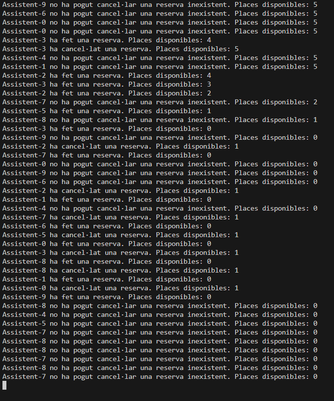

# Preguntes teòriques 


### 1. Per què s'atura l'execució al cap d'un temps? 

Se para por usar el uso de de wait() y notifyAll() . 
Si hay un bloqueo que no se resuelve correctamente, algunos hilos pueden quedar esperando indefinidamente, lo que hace que el programa se detenga.

En mi caso, el wait() se ejecuta en el método ferReserva() cuando no hay plazas disponibles. Si, por alguna razón, no hay más lugares disponibles y no se está notificando a los hilos correctamente, los hilos pueden quedar bloqueados y no ejecutarse de nuevo.

---
### 2. Què passaria si en lloc de una probabilitat de 50%-50% fora de 70% (ferReserva)-30% (cancel·lar)? I si foren al revés les probabilitats? → Mostra la porció de codi modificada i la sortida resultant en cada un dels 2 casos 

#### 70% (ferReserva)-30% (cancel·lar)

``Assistent.java``
```java
@Override
public void run() {
    Random random = new Random();
    while (true) {
        try {
            // Espera aleatoria entre 0 y 1 segundo
            Thread.sleep(random.nextInt(1001));  // 0-1000 ms (0-1 segundo)
            synchronized (esdeveniment) {
                // Generar un número aleatorio entre 0 y 1
                if (random.nextDouble() < 0.7) {
                    // 70% de probabilidad de hacer una reserva
                    esdeveniment.ferReserva(this);
                } else {
                    // 30% de probabilidad de cancelar una reserva
                    esdeveniment.cancelaReserva(this);
                }
            }
        } catch (InterruptedException e) {
            e.printStackTrace();
        }
    }
}
````
#### Salida: 


#### 30% (ferReserva)-70% (cancel·lar)

``Assistent.java``
```java
@Override
public void run() {
    Random random = new Random();
    while (true) {
        try {
            // Espera aleatoria entre 0 y 1 segundo
            Thread.sleep(random.nextInt(1001));  // 0-1000 ms (0-1 segundo)
            synchronized (esdeveniment) {
                // Generar un número aleatorio entre 0 y 1
                if (random.nextDouble() < 0.3) {
                    // 30% de probabilidad de hacer una reserva
                    esdeveniment.ferReserva(this);
                } else {
                    // 70% de probabilidad de cancelar una reserva
                    esdeveniment.cancelaReserva(this);
                }
            }
        } catch (InterruptedException e) {
            e.printStackTrace();
        }
    }
}
````
#### Salida:



---

### 3. Perquè creus que fa falta la llista i no valdria només amb una variable sencera de reserves? 

 > Usar solo un número para contar las reservas no sería suficiente porque perderíamos la información sobre **quién ha reservado** y **quién cancela su reserva**. La lista nos permite gestionar mejor las inscripciones, asegurándonos de que cada asistente pueda cancelar solo su propia reserva y evitando inconsistencias.


 ---
 Alicia Campo Miron <br> DAM2B